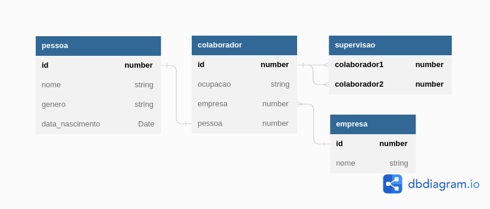
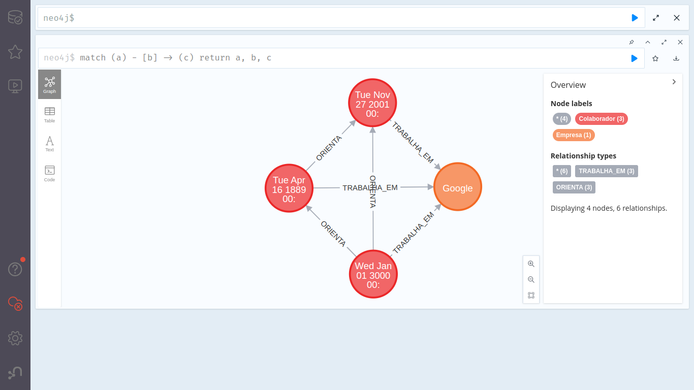

# manipulador-simples-aura-graph

## Sumário

- [manipulador-simples-aura-graph](#manipulador-simples-aura-graph)
  - [Sumário](#sumário)
  - [Motivação](#motivação)
  - [Pilha de tecnologia](#pilha-de-tecnologia)
  - [Galeria](#galeria)
  - [Como rodar](#como-rodar)
    - [Pré-requisitos](#pré-requisitos)
    - [Passo a passo](#passo-a-passo)

## Motivação

Este foi o segundo repositório de código apresentado no [Curso Superior de TSI do IFMS](https://www.ifms.edu.br/campi/campus-aquidauana/cursos/graduacao/sistemas-para-internet/sistemas-para-internet) como requisito para obtenção da nota parcial de uma atividade da unidade curricular Banco de Dados II, a qual consistiu em redigir um tutorial de como se conectar a um banco de dados Neo4j AuraDB e cadastrar quaisquer vértices/arestas utilizando uma linguagem de programação de preferência do discente.

O exemplo confeccionado para esta atividade utiliza um [modelo relacional](#galeria) redigido por mim para explicar como o mecanismo do banco de dados Neo4j AuraDB facilita relacionamentos de muitos para muitos. Entretanto, como o enunciado da atividade é simples e não exige verificação e validação, o app desenvolvido pulou várias etapas de segurança, como por exemplo: verificar a existência de um vértice no grafo antes de cadastrá-lo.

Apesar disso, reconheço que os códigos-fonte presentes neste repositório são rudimentares e não devem ser utilizados em quaisquer apps profissionais a fim de evitar confeccção de código-fonte legado. Portanto, foram escritos apenas para fins didáticos.

## Pilha de tecnologia

As seguintes tecnologias foram utilizadas para desenvolver este app:

| Papel | Tecnologia |
|-|-|
| Ambiente de execução | [Node](https://nodejs.org/en/) |
| Linguagem de programação | [TypeScript](https://www.typescriptlang.org/) |
| Banco de dados | [Neo4j AuraDB](https://neo4j.com/cloud/platform/aura-graph-database/) |

## Galeria




## Como rodar

### Pré-requisitos

- [Node](https://nodejs.org/en/download/);
- [Yarn](https://yarnpkg.com/) (opcional);
- Conta no site [Neo4j](https://neo4j.com/cloud/platform/aura-graph-database/).

### Passo a passo

1. Clone o repositório de código em sua máquina;
   
2. Abra um shell de comando de sua preferência (prompt de comando, PowerShell, terminal _etc_.);
   
3. Instale as dependências do projeto através do seguinte comando:

```console
$ npm install
```

Caso esteja utilizando o gerenciador de pacotes Yarn, execute o seguinte comando como alternativa:

```console
$ yarn
```

4. Com as dependências instaladas, crie um arquivo intitulado `.env` na raiz do projeto e adicione o seguinte conteúdo nele:

```properties
DATABASE_URI_CONNECTION=
DATABASE_USER_NAME=
DATABASE_USER_PASSWORD=
```

Tal arquivo deve conter as credenciais de acesso à instância de um banco de dados Neo4j AuraDB. Então, caso ainda não tenha criado essa instância, [registre-se no site](https://console.neo4j.io/?action=signup&product=aura-db) e crie-a.

5. Ao criar a instância, copie a senha que será gerada automaticamente pelo site. Note que o site não a exibirá novamente, então, se você perdeu essa senha, delete a instância criada e crie outra instância. Feito isso, preencha o arquivo `.env` com as credenciais já fornecidas pelo site: o nome de usuário, no valor da variável de ambiente `DATABASE_USER_NAME`; e a respectiva senha, no valor da variável de ambiente `DATABASE_USER_PASSWORD`;

6. Copie o endereço eletrônico de conexão ao banco de dados presente em um dos códigos-fonte exemplares na página da instância e cole-o no valor da variável de ambiente `DATABASE_URI_CONNECTION`;

7. Finalmente, execute o seguinte comando para iniciar o app:

Para npm:

```console
$ npm run start
```

Para Yarn:

```console
$ yarn start
```

Note que você pode customizar o código-fonte [`index.ts`](./index.ts), adicionando novas(os) empresas/colaboradores.